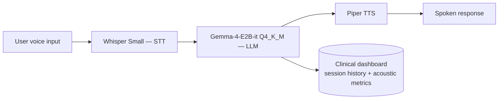

<div align="center">

# Virtual Conversational Assistant for Emotional Support Based on AI

[](#presentation-history--project-status)
[](https://www.python.org/)
[](https://huggingface.co/blog/gemma4)
[](LICENSE)

**Universidad de Sucre · Sincelejo-Sucre, Colombia**

[Paper](#citation) · [Architecture](#architecture) · [Status](#presentation-history--project-status)

</div>

---
## Overview

Documentation repository for the ongoing research project (originally developed in Spanish):

> **Asistente Virtual Conversacional para el Acompañamiento Emocional Basado en Inteligencia Artificial**
>
> Jose Carlos Arroyo Cantero, Iván Mauricio Gómez Pérez, Lucas Mateo Rivadeneira Zarza, Enoc David Samur Martínez, Melba Liliana Vertel Morinson (Advisor)
>
> 35° Simposio Internacional de Estadística (SIE 2026) — Universidad Nacional de Colombia

*(English title: "Virtual Conversational Assistant for Emotional Support Based on Artificial Intelligence")*

Access to mental health services is severely limited in Colombia — only ~12% of the 66.3% of the population that has faced a mental health issue receives adequate care, a gap that is especially acute in the department of Sucre, which recorded the second-highest suicide rate in the Colombian Caribbean region in 2023. This project develops a **fully local, voice-based conversational agent** for real-time emotional support, designed to complement — not replace — professional psychological care in contexts with limited access to mental health services.

The system operates entirely offline, without cloud dependency, and integrates a large language model with speech-to-text and text-to-speech modules, guided by a system prompt grounded in four validated psychological frameworks.

> **This is applied research in progress, not a clinical or diagnostic tool.** Testing to date has been limited to simulated users in a controlled environment; the system has not been validated with real patients and does not include an independent crisis-detection layer. See [Limitations](#limitations--future-work).

---

## Architecture

The pipeline runs four modules sequentially, fully on-device:


**Model:** `gemma-4-e2b-it`, quantized to **Q4_K_M** — chosen specifically to fit the project's compute budget while retaining acceptable instruction-following quality for the emotional-support domain.

**System prompt design** is grounded in four validated psychological frameworks:
- Person-centered therapy core conditions (Rogers, 1957) → active listening, unconditional acceptance
- Psychological First Aid (WHO / War Trauma Foundation / World Vision, 2011) → stabilization rules, crisis safety protocol
- Dialectical Behavior Therapy validation levels (Linehan, 1993) → validate before questioning or redirecting
- Motivational Interviewing principles (Miller & Rollnick, 2013) → open, non-directive questions; no unsolicited advice

A complementary **clinical management dashboard** (SQLite-backed) tracks session history (calls and chats) per user and computes evolving acoustic metrics — mean pitch, energy variability, cumulative session duration, and an emotional stability estimate.

---

## Objectives

**General objective:** develop an AI-based conversational agent for real-time emotional support, using efficient natural language processing systems and advanced bidirectional audio handling techniques, offering psychological support to individuals in contexts with limited access to mental health services.

**Specific objectives:**
1. Analyze the state of the art in NLP and bidirectional audio systems applied to mental health, through a literature review.
2. Implement the conversational agent's architecture, using local language processing models alongside speech transcription and synthesis technologies.
3. Evaluate the agent's performance using latency, conversational coherence, and empathy metrics, under controlled test scenarios.

---

## Methodology

Four sequential phases:

1. **Literature review & tool selection** — Python as the pipeline's integration language, LM Studio as the local inference environment; three functional modules identified (LLM, STT, TTS).
2. **Creation & integration of the conversational model** — sequential coupling of STT (Whisper Small) → LLM (Gemma 4 E2B, quantized) → TTS (Piper, voices *Daniela* and *CarlFM*).
3. **System prompt design** — grounded in the four psychological frameworks above, with differentiated conversation topics (general, grief, anxiety, loneliness), each with its own tone and presence rules.
4. **Testing & optimization** — evaluated with simulated users in a controlled environment, assessing oral interaction fluency, thematic coherence, and sustained empathetic tone; results fed iterative adjustments to the system prompt and inference parameters.

## Presentation History & Project Status

This project has been presented at two academic milestones so far, each reflecting a different stage of development.

| Event | Type | Status | Key content |
|---|---|---|---|
| **RedCOLSI — Nodo Sucre** (Research-in-Progress Registration) | Registration form (Ingenierías area) | Early stage | First formal framing: problem statement, general/specific objectives, theoretical background. Gemma initially proposed for its native audio-processing capability. No implementation yet. |
| **35° Simposio Internacional de Estadística (SIE 2026)** — Universidad Nacional de Colombia, 14–17 Jul 2026 | Conference paper | First functional prototype | Full three-module pipeline implemented (Whisper Small + Gemma 4 E2B + Piper TTS) and tested locally with simulated users. Clinical dashboard with longitudinal acoustic tracking added. System prompt v1 grounded in four psychological frameworks. Explicitly reported as a **first prototype**, not a finished or clinically validated system. |

The project remains classified as **"Investigación en Curso"** (Research in Progress) per its RedCOLSI registration — results here should be read as preliminary.

---

## Limitations & future work

As stated in the SIE 2026 paper's own conclusions:

- The system depends on a reduced-parameter quantized model with no crisis-detection layer independent of the LLM — a risk that must be addressed before any real-world deployment.
- Testing so far has used simulated users in a controlled environment; performance has not been generalized to real emotional-vulnerability scenarios.
- Planned next steps: fine-tuning on public-domain clinical-psychological corpora, adding an independent crisis-classification layer, and evaluating the system in real scenarios under the supervision of mental health professionals.

---

## Authors

| Name | Role | Institution | Email |
|---|---|---|---|
| Jose Carlos Arroyo Cantero | Author | Universidad de Sucre | jose.arroyo54@unisucrevirtual.edu.co |
| Lucas Mateo Rivadeneira Zarza | Author | Universidad de Sucre | lucas.rivadeneira@unisucrevirtual.edu.co |
| Enoc David Samur Martínez | Author | Universidad de Sucre | enoc.samur@unisucrevirtual.edu.co |
| Melba Liliana Vertel Morinson | Advisor | Universidad de Sucre | melba.vertel@unisucre.edu.co |

Research group: **G.I. Estadística y Modelamiento Matemático**, Universidad de Sucre.

---

## Citation

If you reference this work, please cite:

```bibtex
@inproceedings{arroyo2026virtualassistant,
  title     = {Asistente Virtual Conversacional para el Acompañamiento Emocional Basado en Inteligencia Artificial},
  author    = {Arroyo Cantero, Jose Carlos and Rivadeneira Zarza, Lucas Mateo and Samur Martínez, Enoc David and Vertel Morinson, Melba Liliana},
  booktitle = {35° Simposio Internacional de Estadística (SIE 2026)},
  year      = {2026},
  publisher = {Universidad Nacional de Colombia},
  url       = {}
}
```

---

## License

This repository is licensed under the **MIT License** — see [LICENSE](LICENSE) for details. The PDFs in `docs/` are included for reference; check with the authors before reuse of the written content itself.

---

## References

Key references from the paper:

- World Health Organization (2025) — Mental health conditions global statistics
- Ministerio de Salud y Protección Social, Colombia (2023, 2026) — National mental health surveys
- DANE (2024) — Colombia vital statistics, non-fetal deaths
- Google DeepMind (2026) — Gemma 4 technical overview
- Rogers, C. R. (1957) — Necessary and sufficient conditions of therapeutic personality change
- WHO, War Trauma Foundation & World Vision International (2011) — Psychological First Aid
- Linehan, M. M. (1993) — Cognitive-behavioral treatment of borderline personality disorder
- Miller, W. R. & Rollnick, S. (2013) — Motivational Interviewing: Helping people change

---

<div align="center">
Made with ❤️ by <strong>GEMMA Research Group</strong> · Universidad de Sucre · Sincelejo, Colombia
</div>
