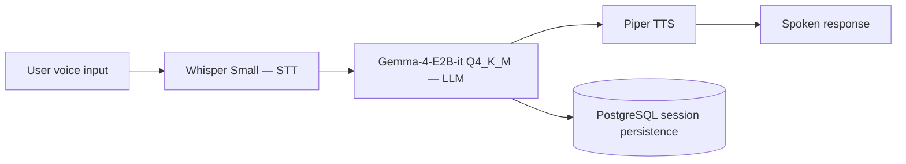
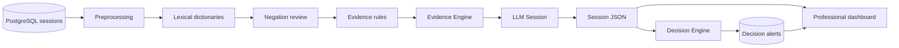

<div align="center">

# Virtual Conversational Assistant for Emotional Support Based on AI

[](#presentation-history--project-status)
[](https://www.python.org/)
[](https://huggingface.co/blog/gemma4)
[](LICENSE)

**Universidad de Sucre · Sincelejo-Sucre, Colombia**

[Paper](#citation) · [Architecture](#architecture) · [Status](#presentation-history--project-status)

</div>

---

## Overview

Documentation repository for the ongoing research project (originally developed in Spanish):

> **Asistente Virtual Conversacional para el Acompañamiento Emocional Basado en Inteligencia Artificial**
>
> Jose Carlos Arroyo Cantero, Iván Mauricio Gómez Pérez, Lucas Mateo Rivadeneira Zarza, Enoc David Samur Martínez, Melba Liliana Vertel Morinson (Advisor)
>
> 35° Simposio Internacional de Estadística (SIE 2026) — Universidad Nacional de Colombia

*(English title: "Virtual Conversational Assistant for Emotional Support Based on Artificial Intelligence")*

Access to mental health services is severely limited in Colombia — only ~12% of the 66.3% of the population that has faced a mental health issue receives adequate care, a gap that is especially acute in the department of Sucre, which recorded the second-highest suicide rate in the Colombian Caribbean region in 2023.

This project develops a **fully local, voice-based conversational agent** for real-time emotional support, designed to complement — not replace — professional psychological care in contexts with limited access to mental health services.

The system operates locally and integrates a large language model with speech-to-text and text-to-speech modules, guided by a system prompt grounded in four validated psychological frameworks. Since the first functional prototype, the project has also incorporated **PostgreSQL session persistence, a traceable clinical-intelligence pipeline, rule-based evidence generation, protective-factor detection, longitudinal indicators, a decision engine, LLM-assisted session summaries, and a professional dashboard**.

> **This is applied research in progress, not a clinical or diagnostic tool.** The current system remains a research prototype and has not been clinically validated for autonomous use with patients. The evidence, indicators and alerts generated by the system are intended to support analysis and follow-up, not to replace professional judgment. See [Limitations & future work](#limitations--future-work).

> **Version scope:** this README documents the project up to the features presented at **CONASIE**. Features developed afterward for **RedColsi Nacional** are intentionally excluded from this version and will be documented in a later update.

---

## Architecture

The current architecture separates the **conversational interaction layer** from the **clinical-intelligence layer**.

### Conversational flow



**Model:** `gemma-4-e2b-it`, quantized to **Q4_K_M** — chosen specifically to fit the project's compute budget while retaining acceptable instruction-following quality for the emotional-support domain.

**System prompt design** is grounded in four validated psychological frameworks:

- Person-centered therapy core conditions (Rogers, 1957) → active listening, unconditional acceptance
- Psychological First Aid (WHO / War Trauma Foundation / World Vision, 2011) → stabilization rules, crisis safety protocol
- Dialectical Behavior Therapy validation levels (Linehan, 1993) → validate before questioning or redirecting
- Motivational Interviewing principles (Miller & Rollnick, 2013) → open, non-directive questions; no unsolicited advice

The conversational prototype was later strengthened through updated behavioral instructions, crisis-oriented directives and more explicit interaction rules. The local LLM, STT and TTS components were already part of the previous prototype; this stage focused on improving their coordination and the assistant's behavioral guidance.

### Clinical-intelligence flow



The clinical-intelligence layer currently includes:

- lexical dictionaries for multiple emotional-signal categories;
- negation review;
- atomic evidence generation;
- rule-based composite evidence;
- evidence consolidation;
- protective-factor detection;
- longitudinal protective-factor indicators;
- LLM-assisted session contextualization;
- a configurable Decision Engine;
- persistent alerts;
- a read-only professional dashboard.

A central design principle is that the **LLM does not determine risk from scratch**. The system first extracts and consolidates traceable evidence, and the LLM is then used to contextualize and summarize the session.

The dashboard is now **PostgreSQL-backed** and can display conversation history, text metrics, acoustic metrics, contextual summaries, detected findings, protective factors and decision alerts.

---

## Objectives

**General objective:** develop an AI-based conversational agent for real-time emotional support, using efficient natural language processing systems and advanced bidirectional audio handling techniques, offering psychological support to individuals in contexts with limited access to mental health services.

**Specific objectives:**

1. Analyze the state of the art in NLP, bidirectional audio systems and early emotional-risk detection applied to mental health.
2. Strengthen the conversational assistant and integrate relational session persistence for structured conversation storage.
3. Implement a clinical-intelligence pipeline based on dictionaries, rules, evidence, indicators and decision logic.
4. Generate LLM-assisted contextual summaries and structured information to support follow-up and referral-oriented analysis.
5. Evaluate the system through technical metrics, consistency checks and controlled validation scenarios.

---

## Methodology

The current methodology is organized into four main phases:

1. **Literature review & tool selection** — review of NLP, bidirectional audio, conversational AI and emotional-risk detection approaches; Python retained as the integration language and LM Studio as the local inference environment.

2. **Conversational prototype strengthening** — refinement of system instructions, behavioral directives, crisis-oriented guidance and interaction flow while preserving the previously implemented local STT → LLM → TTS architecture.

3. **Persistence & automated analysis** — migration of session persistence to PostgreSQL and implementation of the clinical-intelligence pipeline, including lexical dictionaries, negation handling, evidence rules, evidence consolidation, protective factors, longitudinal indicators, LLM Session summaries and decision alerts.

4. **Evaluation & validation** — controlled validation of the system through technical metrics, conversational coherence, evidence consistency, risk-signal detection and case-based testing.

---

## Clinical Intelligence Pipeline

### Lexical dictionaries

The system uses configurable YAML dictionaries to identify expressions associated with categories such as:

- suicidal ideation;
- hopelessness;
- isolation;
- substance use;
- protective factors.

Dictionary entries can include linguistic variants, polarity, severity, confidence metadata and negation-review requirements.

### Negation handling

Potential matches are reviewed for negation before being treated as affirmative evidence.

For example:

```text
"No tengo con quién hablar."
```

must not be interpreted as social support. In the current dictionaries, it is treated as an isolation-related expression.

### Evidence Engine

Matched expressions produce atomic evidence that can include:

```text
category
polarity
severity
confidence
source_text
source_detail
turn_id
negation_result
```

Rule-based evidence can then be generated from temporal or co-occurrence patterns.

Current rule types include:

```text
count_window
co_occurrence
absence_after_presence
```

The Evidence Engine consolidates these signals into a structured `Session JSON`.

### LLM Session

The LLM Session component receives already-extracted evidence and conversation context to generate:

```text
contextual_summary
llm_notes
```

Its purpose is contextualization and summarization. It does not replace deterministic evidence extraction or the Decision Engine.

### Decision Engine

The Decision Engine evaluates the consolidated session output and can generate persistent alerts.

Examples currently implemented include:

| Rule | General condition | Result | Priority |
|---|---|---|---|
| `decision_001` | Immediate-risk evidence | `crisis_risk` | Critical |
| `decision_002` | High-confidence hopelessness | High-risk alert | High |
| `decision_003` | Persistent hopelessness | `pattern_alert` | Medium |
| `decision_004` | Loss of protective factors | `pattern_alert` | Medium |
| `decision_005` | Isolation detected | `context_flag` | Low |

These rules are part of a research prototype and must not be interpreted as clinical diagnostic criteria.

---

## Protective Factors

The system now identifies **protective factors** in addition to risk-related signals.

Protective factors represent resources, intentions or forms of support that may contribute to emotional coping.

Current categories include expressions related to:

- reasons for continuing;
- family support;
- general social support;
- friendship support;
- trusted people;
- help-seeking;
- intention to connect with others;
- future orientation;
- useful coping strategies;
- self-care intentions.

Examples detected during controlled testing include:

```text
"Hablar con alguien también ayuda"
"Podría dar una vuelta"
"Voy a intentar salir un rato y despejarme"
```

Protective expressions are subject to negation review before being counted as affirmative evidence.

---

## Longitudinal Analysis

A first longitudinal indicator was incorporated to evaluate changes in protective factors across multiple sessions from the same user.

For each session:

```text
protective_factor_rate =
    affirmative protective evidence
    /
    patient turns
```

The metric is persisted inside the session envelope:

```json
{
  "longitudinal_metrics": {
    "patient_turn_count": 18,
    "protective_evidence_count": 3,
    "protective_factor_rate": 0.1667
  }
}
```

An `absence_after_presence` rule was also implemented to detect a possible loss of protective factors.

The validated configuration compares:

```text
3 previous sessions + 2 recent sessions
```

The rule is evaluated only when sufficient valid historical data exists.

Event, demonstration and shared-account sessions must not be treated as longitudinal evidence unless they can be attributed to the same person across time.

---

## Persistence

Session storage was migrated to **PostgreSQL**.

Main tables currently used by the system include:

```text
raw_data.sessions
raw_data.messages
public.session_envelopes
public.decision_alerts
```

- `raw_data.sessions` stores session-level metadata.
- `raw_data.messages` stores conversation turns.
- `public.session_envelopes` stores the structured analysis output for each processed session.
- `public.decision_alerts` stores alerts generated by the Decision Engine.

This separation keeps original conversation data distinct from derived evidence and decision outputs.

---

## Professional Dashboard

The professional dashboard provides a read-only view of the stored conversation and analysis results.

Current functionality includes:

- user/session navigation;
- conversation history;
- text metrics;
- acoustic metrics;
- contextual session summary;
- detected risk findings;
- detected protective factors;
- persistent decision alerts.

The dashboard reads the most recent session envelope and associated alerts from PostgreSQL. It does not independently create clinical evidence.

---

## Validation Cases

### Crisis-oriented validation

An early test exposed insufficient lexical coverage in the initial suicidal-ideation dictionary. The first version produced no matches for several common Spanish expressions associated with ending one's life.

After extending the relevant dictionaries, the same test produced:

- **6 atomic evidences**;
- activation of `rule_direct_ideation`;
- generation of `direct_suicidal_ideation`;
- combined confidence of approximately **0.9984** for `suicidal_ideation`;
- immediate review priority.

This result demonstrated that small stub dictionaries are insufficient for high-severity categories and require systematic expansion and validation.

### Protective-factor validation

In a controlled session containing 18 patient turns, the system identified three protective-factor evidences:

```text
"Hablar con alguien también ayuda"
"podría dar una vuelta"
"Voy a intentar salir un rato y despejarme"
```

Result:

```text
protective_evidence_count = 3
patient_turn_count = 18
protective_factor_rate = 0.1667
```

The consolidated `protective_factors` confidence was approximately **0.875**, and no decision alert was triggered.

### Isolation validation

In another controlled session, the system identified:

```text
"prácticamente no hablé con nadie en todo el día"
```

as an isolation-related expression.

Result:

```text
category = isolation
severity = low
confidence = 0.5
```

This finding triggered:

```text
rule_id = decision_005
alert_type = context_flag
priority = low
```

---

## Presentation History & Project Status

This project has been presented at multiple academic milestones, each reflecting a different stage of development.

| Event | Type | Status | Key content |
|---|---|---|---|
| **RedCOLSI — Nodo Sucre** (Research-in-Progress Registration) | Registration form (Ingenierías area) | Early stage | First formal framing: problem statement, general/specific objectives, theoretical background. Gemma initially proposed for its native audio-processing capability. No implementation yet. |
| **35° Simposio Internacional de Estadística (SIE 2026)** — Universidad Nacional de Colombia, 14–17 Jul 2026 | Conference paper | First functional prototype | Three-module local pipeline implemented (Whisper Small + Gemma 4 E2B + Piper TTS), simulated-user testing, first clinical-management dashboard and system prompt grounded in four psychological frameworks. |
| **CONASIE 2026** | Research presentation | Expanded functional prototype | PostgreSQL persistence, traceable clinical-intelligence pipeline, expanded dictionaries, negation review, evidence rules, Evidence Engine, LLM Session, Decision Engine, protective-factor detection, first longitudinal indicators, persistent alerts and integration with the professional dashboard. |

The project remains classified as **"Investigación en Curso"** (Research in Progress). Results should be interpreted as preliminary research outputs.

> Features developed after the CONASIE milestone for **RedColsi Nacional** are not included in this README version.

---

## Limitations & future work

The current version addresses several limitations of the first prototype, particularly the absence of an analysis layer independent from the conversational LLM. However, important limitations remain:

- Lexical dictionaries still require systematic expansion and expert review before any clinical deployment.
- Exact lexical matching remains sensitive to paraphrases and STT transcription errors.
- Decision thresholds and evidence confidence values require validation with a broader sample.
- Longitudinal analysis requires multiple valid sessions from the same individual and must exclude event/demo sessions that do not represent a single user over time.
- Current results remain preliminary and are not sufficient for autonomous clinical decision-making.
- The system still requires controlled evaluation with support from mental-health professionals.
- Semantic embeddings and specialized fine-tuned NLP components remain areas for further development.

Planned work includes:

- broader dictionary validation;
- improved semantic robustness;
- expanded longitudinal evaluation;
- refinement of decision rules and indicators;
- professional review of evidence categories and thresholds;
- controlled evaluation in scenarios supervised by mental-health professionals.

---

## Authors

| Name | Role | Institution | Email |
|---|---|---|---|
| Jose Carlos Arroyo Cantero | Author | Universidad de Sucre | jose.arroyo54@unisucrevirtual.edu.co |
| Iván Mauricio Gómez Pérez | Author | Universidad de Sucre | |
| Lucas Mateo Rivadeneira Zarza | Author | Universidad de Sucre | lucas.rivadeneira@unisucrevirtual.edu.co |
| Enoc David Samur Martínez | Author | Universidad de Sucre | enoc.samur@unisucrevirtual.edu.co |
| Melba Liliana Vertel Morinson | Advisor | Universidad de Sucre | melba.vertel@unisucre.edu.co |

Research group: **G.I. Estadística y Modelamiento Matemático**, Universidad de Sucre.

---

## Citation

If you reference this work, please cite:

```bibtex
@inproceedings{arroyo2026virtualassistant,
  title     = {Asistente Virtual Conversacional para el Acompañamiento Emocional Basado en Inteligencia Artificial},
  author    = {Arroyo Cantero, Jose Carlos and Gómez Pérez, Iván Mauricio and Rivadeneira Zarza, Lucas Mateo and Samur Martínez, Enoc David and Vertel Morinson, Melba Liliana},
  booktitle = {35° Simposio Internacional de Estadística (SIE 2026)},
  year      = {2026},
  publisher = {Universidad Nacional de Colombia},
  url       = {}
}
```

---

## License

This repository is licensed under the **MIT License** — see [LICENSE](LICENSE) for details. The PDFs in `docs/` are included for reference; check with the authors before reuse of the written content itself.

---

## References

Key references from the paper:

- World Health Organization (2025) — Mental health conditions global statistics
- Ministerio de Salud y Protección Social, Colombia (2023, 2026) — National mental health surveys
- DANE (2024) — Colombia vital statistics, non-fetal deaths
- Google DeepMind (2026) — Gemma 4 technical overview
- Rogers, C. R. (1957) — Necessary and sufficient conditions of therapeutic personality change
- WHO, War Trauma Foundation & World Vision International (2011) — Psychological First Aid
- Linehan, M. M. (1993) — Cognitive-behavioral treatment of borderline personality disorder
- Miller, W. R. & Rollnick, S. (2013) — Motivational Interviewing: Helping people change

---

<div align="center">

Made with ❤️ by <strong>GEMMA Research Group</strong> · Universidad de Sucre · Sincelejo, Colombia

</div>